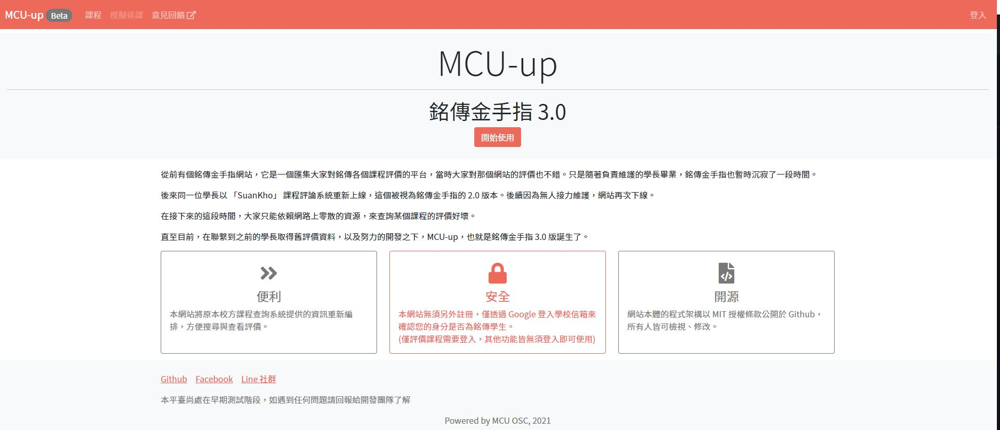
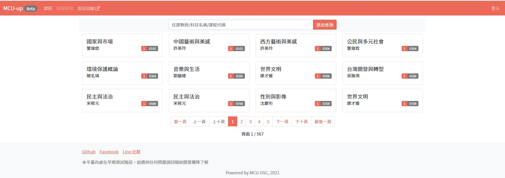
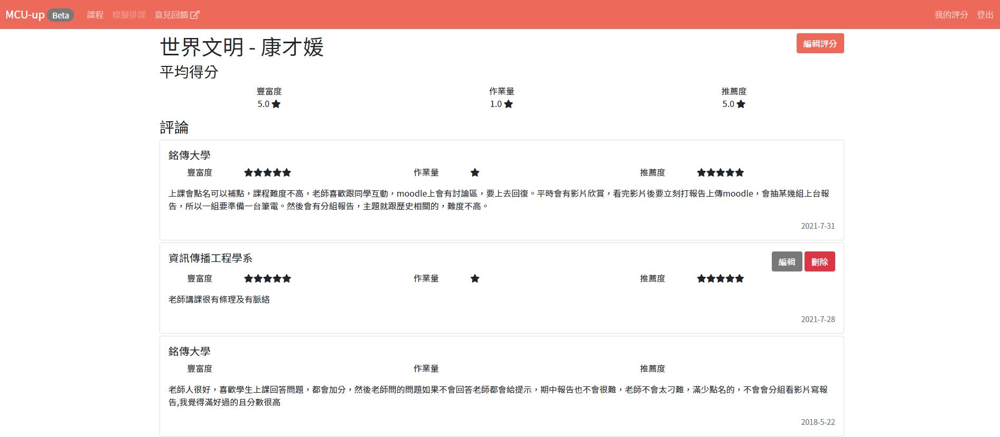

MCU-up
===
此專案為[MCU-up-beta](https://github.com/mcuosc/MCU-up-beta) 的穩定版本，如需使用請參考 [LICENSE](https://github.com/mcuosc/MCU-up/blob/main/LICENSE)

## 事前準備

使用此專案前所需安裝的工具：
1. [Nodejs](https://nodejs.org/en/)
2. [MongoDB](https://www.mongodb.com)

建議工具：
1. [RoBo3T](https://robomongo.org/)：看 mongoDB 的 GUI 程式

建立流程
---

1. clone本專案
2. 執行main.py
3. Google的token，需要新增 .env 檔案
4. 執行 `npm install` 以安裝所需套件。
5. 如要執行本專案在小黑下 `npm run dev` (For Development), `npm start` (For Production)。(Default PORT - 3000)

## SCREENSHOT

